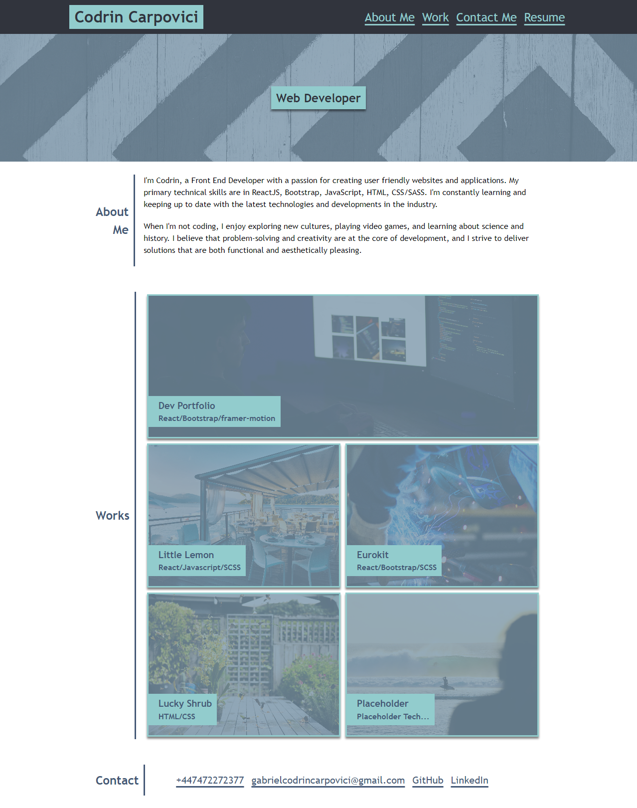

# edX Portfolio

## Description

Personal Web Developer Portfolio. Used to showcase projects I have been working on and for future bootcamp projects. The website ensures that best practices for accesibility and Search Engine Optimization are followed through the use of Semantic HTML and responsive CSS Design.

## Table of Contents

* [Installation](#installation)
* [Usage](#usage)
* [Credits](#credits)
* [License](#license)
* [Badges](#badges)

## Installation

N/A

## Usage 

Go To: [codrincarpovici.github.io/portfolioedx/](https://codrincarpovici.github.io/portfolioedx/) and view the website. 

On the website you can click the different navigation links in the navbar to get to the respective sections.
You can also read the About Me section where I added a summary of myself.
Additionally you can visit other projects I have done by clicking on the different cards on the website.
The Contact Section also provides links to my contact information which are clickable.
Screen Readers can also follow the semantic structure of the page and it is also mobile-firendly.

## Credits

N/A

## License

## Badges

